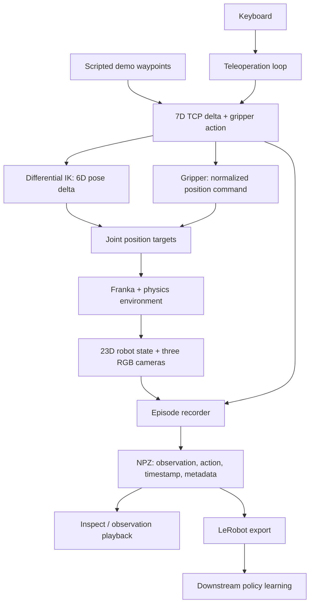

# Isaac Sim Teleoperation & Demonstration Pipeline

A Franka Panda manipulation environment for **robot control, multimodal observation, and demonstration collection** in Isaac Sim / Isaac Lab. Collect synchronized RGB, robot state, and actions as episodes, inspect and replay the recordings, and export them to LeRobot for downstream imitation learning.

## Demo — grasp an apple and place it in the bin


[Demo script](pp_scripts/record_pick_place_demo.py) · [Validation report](assets/pick_place_demo_report.json) · [Reproduce this demo](#run-the-headless-demo)

This is a **single-apple example**, driven by known waypoints. The default collection task asks for **both the banana and the apple** to be placed in the bin. The GIF is not a trained-policy rollout or a keyboard demonstration.

## What the repository provides

| Component | Implementation |
|---|---|
| Environment | Franka Panda, ground-plane workspace, apple, banana, open KLT bin, lighting, rigid-body physics |
| Reset | Seeded robot/object randomization; explicit reset and automatic timeout/success reset |
| Control | Relative TCP pose commands through differential IK, joint position targets, continuous gripper command |
| Teleoperation | Keyboard motion and gripper control; record, stop, reset, and save controls |
| Observations | 23D robot state and three RGB cameras: overhead, wrist, oblique |
| Recording | Pre-action observation paired with its action; simulation timestamps and episode metadata |
| Dataset tools | Structural validation, RGB/action video playback, and LeRobot export |
| Executable example | Headless apple pick-and-place, with physical lift and final containment checks |

Training ACT, Diffusion Policy, or a VLA model is outside the validated pipeline. Existing policy integration scripts are experimental and require separate checkpoints and configuration.

## Setup

### 1. Prepare Isaac Sim and Isaac Lab

The local validation stack is **Ubuntu 22.04, Python 3.11, Isaac Sim 5.1.0, Isaac Lab 2.3.0, and PyTorch 2.7.0**, running on an RTX 4060 Laptop GPU with 8 GB VRAM. This is a tested configuration, not a minimum hardware specification. Headless rendering still requires a working NVIDIA GPU/driver; keyboard collection additionally requires a graphical desktop session.

Install the simulator and Isaac Lab using the [versioned Isaac Lab installation guide](https://isaac-sim.github.io/IsaacLab/v2.3.0/source/setup/installation/pip_installation.html). Use the 5.1.0 / Python 3.11 combination and the Isaac Lab `v2.3.0` source tag rather than an unpinned development branch. Complete the upstream empty-scene check before installing this project.

For Linux x86_64 with Python 3.11 and a compatible NVIDIA driver already installed, the corresponding environment setup is:

```bash
python3.11 -m venv env_isaaclab
source env_isaaclab/bin/activate
python -m pip install --upgrade pip
python -m pip install "isaacsim[all,extscache]==5.1.0" --extra-index-url https://pypi.nvidia.com
python -m pip install torch==2.7.0 torchvision==0.22.0 --index-url https://download.pytorch.org/whl/cu128
git clone --depth 1 --branch v2.3.0 https://github.com/isaac-sim/IsaacLab.git
cd IsaacLab
./isaaclab.sh --install none
python scripts/tutorials/00_sim/create_empty.py --headless
# Stop the empty-scene example with Ctrl+C after it initializes.
cd ..
```

Complete any first-launch license prompt yourself. Keep this environment activated for the project commands below; installing this repository alone does **not** install Isaac Sim or Isaac Lab.

### 2. Clone and install this project

Git LFS is used for existing media in the repository; install Git LFS if it is not already available.

```bash
git lfs install
git clone https://github.com/ChrisRuihanWang/isaacsim-teleop-data-pipeline.git
cd isaacsim-teleop-data-pipeline

python -m pip install -e . --no-deps
python -m pip install pynput==1.8.1 scipy==1.15.3 pillow==11.3.0 \
  imageio==2.37.0 imageio-ffmpeg==0.6.0
```

Keep Isaac Lab's NumPy and CUDA/PyTorch dependencies in this environment. The recorder and offline tools use NumPy; the commands above add the keyboard, asset preparation, and video dependencies.

### 3. Prepare assets and validate the environment

```bash
python pp_scripts/fetch_task_assets.py
python pp_scripts/fetch_task_assets.py --check
bash pp_scripts/local.sh validate --resets 3 --steps 60 --seed 42
```

Asset setup downloads the pinned apple, banana, bin, and textures, verifies their hashes, and generates the fruit physics layers and geometry metadata. The first simulator launch may also fetch the upstream Franka asset. Internet access is needed until these assets and simulator extensions are cached.

Validation creates a fresh `data/local_validation_XXXXXX/` directory with `report.json` and camera PNGs. A successful run ends with `PASS:` and a report containing `"passed": true`. It checks seeded reset reproducibility, non-overlapping randomized poses, fresh RGB/state observations, settling, timeout reset, and one-fruit/two-fruit success cases. Its positive placement test initializes fruits inside the bin; the demo below performs the actual pick-and-place motion.

If Isaac Sim uses a different interpreter from your shell, the launcher accepts:

```bash
export ISAAC_PYTHON=/path/to/isaac-environment/bin/python
bash pp_scripts/local.sh validate
```

### Run the headless demo

```bash
bash pp_scripts/local.sh demo --output data/apple_demo --seed 42
python scripts/inspect_dataset.py data/apple_demo
```

Use a **new output directory** for each run. The script refuses to overwrite an existing run. The headless demo enables camera rendering automatically and writes:

```text
data/apple_demo/
├── demo.mp4          # Oblique camera, phase labels, simulation clock; 15 FPS video
├── ep_00000.npz      # All three cameras + state/action at the 30 Hz control rate
├── final.png         # Final placement view
└── report.json       # Physical lift, containment, stable placement, phase errors, trace
```

Require `"passed": true` in the report; an interrupted simulator process may not return a useful shell exit code. The example uses fixed initial object poses with a seeded robot reset. It does not measure success across randomized tasks.

To reproduce the README animation from a successful run:

```bash
python scripts/make_demo_gif.py data/apple_demo/demo.mp4 \
  --output data/apple_demo/demo.gif --speed 3 --fps 10 --width 560
```

## Architecture



Scene/physics configuration, reset logic, action terms, observation terms, and dataset validation live in separate modules. The teleoperation loop currently owns the keyboard mapping and episode buffer. The public action interface is **end-effector delta plus gripper**; joint position targets are generated internally by IK rather than exposed as a separate joint-teleoperation mode.

Physics runs at **120 Hz** with four physics steps per action: **30 Hz control and observation sampling**. Keyboard collection is paced to at most real time; the headless example runs as fast as rendering/physics allow. Dataset timestamps always use simulation time.

## Collect keyboard demonstrations

Run from a graphical desktop with the simulation window visible:

```bash
python record_demo.py --seed 42 --save-dir data/teleop_fruit_v1
```

| Keys | Behavior |
|---|---|
| `W` / `S` | TCP +X / −X |
| `A` / `D` | TCP +Y / −Y |
| `Q` / `E` | TCP +Z / −Z |
| `I` / `K` | Positive / negative X rotation |
| `J` / `L` | Positive / negative Y rotation |
| `U` / `O` | Positive / negative Z rotation |
| Hold `V` / `B` | Close / open gripper |
| `R` | Start recording; press again to save and stop |
| `M` | Save current segment, stop recording, reset environment |
| `N` | Save camera snapshots to `debug_images/` |
| `Esc` | Save current segment and exit |

Translation and rotation use the **robot base frame**, not the camera frame. Defaults are 5 mm and 0.03 rad per control step. For finer movement:

```bash
python record_demo.py --translation-step 0.002 --rotation-step 0.015 --gripper-rate 1.0
```

Start with `R`, manipulate the fruits, then stop with `R` or reset with `M`. Success and timeout also end the current segment and stop recording; press `R` again to start the next one. Segments shorter than six frames are discarded. Saving resumes at the next available `ep_XXXXX.npz` number.

The default task succeeds when **both fruits** are contained below the bin rim, nearly stationary, and released by an open gripper for 15 control steps (0.5 seconds). One fruit in the bin does not terminate it. Episodes time out after 120 simulation seconds. `info["success"]` preserves the success signal from before automatic reset.

The keyboard listener uses `pynput`. A headless SSH session is suitable for the scripted example, but not for interactive keyboard collection. On Linux, use a desktop session compatible with `pynput` (typically X11).

## Observation, action, and episode format

At control step `t`, the recorder stores **`(o_t, a_t)` before applying `a_t`**. RGB and state are copied from the same pre-action observation. This preserves the input/target pairing used for imitation learning.

```text
data/teleop_fruit_v1/
├── ep_00000.npz
├── ep_00001.npz
├── ep_00002.npz
└── debug_images/
```

| NPZ key | Shape / type | Meaning |
|---|---|---|
| `state` | `(T, 23)`, float32 | Relative joint positions/velocities, finger terms, gripper width |
| `action` | `(T, 7)`, float32 | `[dx, dy, dz, dRx, dRy, dRz, gripper]` |
| `rgb_raw` | `(T, H, W, 3)`, uint8 | Overhead RGB, byte range 0–255 |
| `wrist_rgb_raw` | `(T, H, W, 3)`, uint8 | Wrist RGB |
| `oblique_rgb_raw` | `(T, H, W, 3)`, uint8 | Oblique RGB |
| `timestamp` | `(T,)`, float64 | `arange(T) / 30`, seconds from recording start |
| `metadata_json` | Scalar Unicode array | JSON metadata, readable without pickle |

Normal keyboard recordings use **256×256** for all cameras. The headless README example uses **640×480** for the oblique camera and 256×256 for the other two. Inspect shapes rather than assuming all recordings have the same resolution.

State ordering is preserved for compatibility with existing recordings:

| Slice | Meaning |
|---|---|
| `0:9` | Positions relative to default: seven arm joints, then two fingers |
| `9:18` | Corresponding velocities relative to default |
| `18:20` | Repeated finger relative positions |
| `20:22` | Repeated finger relative velocities |
| `22` | Physical gripper width: sum of finger positions, metres |

Arm angles are radians; finger positions are metres; velocities use the corresponding unit per second. Repeated finger terms are intentional compatibility fields, not additional joints. Contact material/friction is configured for grasping, but **contact forces are not part of the recorded observation**.

Actions contain translation increments in metres, axis-angle rotation increments in radians, and a gripper position command in `[-1, 1]`: **−1 open, +1 closed**. They are commands, not measured joint changes or torques. Names and ordering are defined in [`dataset_schema.py`](pp_scripts/dataset_schema.py).

An **episode** is an uninterrupted recording segment; it may start after an environment reset and need not contain a successful task. Metadata includes the recording ID, task, seed, control interval, action/state names, timestamp convention, and end reason. Keyboard recordings include task success; scripted recordings identify their controller and single-object success scope. The scripted example also stores a per-frame `phase` string.

Load without simulator or pickle dependencies:

```python
import json
import numpy as np

with np.load("data/apple_demo/ep_00000.npz", allow_pickle=False) as episode:
    state = episode["state"]
    action = episode["action"]
    timestamp = episode["timestamp"]
    metadata = json.loads(episode["metadata_json"].item())
    print(state.shape, action.shape, metadata["task"])
```

## Inspect and replay

```bash
python scripts/inspect_dataset.py data/teleop_fruit_v1
python scripts/replay_episode.py data/apple_demo/ep_00000.npz \
  --output data/apple_demo/replay.mp4
python scripts/test_dataset_schema.py
```

Inspection reports **episodes, frames, FPS, state dimension, action dimension, and camera shapes**. It rejects missing arrays, mismatched frame counts, invalid values, inconsistent dimensions, and malformed timestamps. Playback produces an MP4 showing all three recorded camera views, action values, and the simulation clock. It needs NumPy, Pillow, ImageIO, and imageio-ffmpeg; it does not launch Isaac Sim.

Playback is **recorded-observation visualization**, not deterministic re-execution of saved actions in physics. Current metadata does not store every initial simulator state needed for exact physics replay.

Legacy NPZ files may contain normalized float images and pickled `meta` arrays. Inspection never unpickles them. Use `--legacy-fps 30` only if that capture rate is known. Older files without all three cameras are incompatible with this pipeline. The playback script requires current byte RGB; the converter retains the legacy image conversion path, whose per-frame stretching cannot recover original sensor colors.

## Export for imitation learning

Use a **separate LeRobot environment** to keep its dependencies independent of Isaac Sim. Conversion was tested with Python 3.10, PyTorch 2.7.1, TorchCodec 0.5, and LeRobot source revision [`6600b60`](https://github.com/huggingface/lerobot/commit/6600b60e7f5cc7476ddc34beaaf0e0692f82e4b6) (package version 0.4.4). See the [LeRobot installation guide](https://huggingface.co/docs/lerobot/installation) for platform and video codec prerequisites.

From this repository, create and activate a separate environment, then install the tested source revision:

```bash
python3.10 -m venv venv_lerobot
source venv_lerobot/bin/activate
python -m pip install --upgrade pip
python -m pip install "lerobot @ git+https://github.com/huggingface/lerobot.git@6600b60e7f5cc7476ddc34beaaf0e0692f82e4b6" tyro==1.0.6
```

Export the single-apple example, explicitly giving its task text. Image mode is useful for an initial round-trip check:

```bash
python pp_scripts/convert_npz_to_lerobot_teleop2.py \
  --args.npz-dir data/apple_demo \
  --args.repo-id local/apple_demo \
  --args.root data/lerobot \
  --args.task "Place the apple into the open bin." \
  --args.resize-hw 256,256 \
  --args.no-use-videos
```

For keyboard recordings, set `--args.npz-dir data/teleop_fruit_v1`; the default task text describes both fruits. Video encoding is enabled by default when `--args.no-use-videos` is omitted. Use a new `repo-id` or output root for each export; `--args.overwrite` deletes the existing target dataset. The default FPS is 30 and must match the recorded simulation rate.

The exporter validates episodes before writing, preserves byte RGB, and finalizes LeRobot's dataset writers. Exported features are:

```text
observation.state
observation.images.overhead
observation.images.wrist
observation.images.oblique
action
timestamp / frame_index / episode_index / task_index
```

Verify loading before using a trainer:

```python
from pathlib import Path
from lerobot.datasets.lerobot_dataset import LeRobotDataset

ds = LeRobotDataset("local/apple_demo", root=Path("data/lerobot/local/apple_demo"))
print(ds.num_episodes, ds.num_frames, ds.fps)
print(ds[0]["observation.state"].shape, ds[0]["action"].shape)
```

This provides the observation/action input format for a compatible policy-learning pipeline. Choosing successful demonstrations, configuring a trainer, and evaluating a learned policy remain separate steps. Scripted and human demonstrations should retain their provenance and should not be treated as interchangeable evaluation evidence.

## Validation and scope

```bash
# Run these in the Isaac Sim environment.
bash pp_scripts/local.sh validate --resets 3 --steps 60
bash pp_scripts/local.sh grasp
```

Local checks cover environment launch, seeded reset, camera/state consistency, timeout/success reset, and physical grasp/lift/release of both fruits. The headless demo additionally checks apple transport and stable placement. Dataset regression tests and LeRobot image/video round trips check alignment and loading. The recorder's start/stop/reset behavior has been exercised with simulated keyboard callbacks; a new desktop's interactive keyboard behavior still needs a manual smoke test.

The workspace is currently a **ground plane**, not a modeled table. The single-apple demo uses a fixed layout and privileged object poses for waypoint construction. Exact physics replay, independent joint teleoperation, force observations, a reusable controller class, and trained-policy evaluation are not implemented as supported public workflows. A clean-machine installation has not yet been independently validated; use the supplied validation commands as acceptance checks on your system.

## Code map

```text
record_demo.py                         # Keyboard collection entry point
pp_scripts/
  local.sh                            # assets / validate / grasp / collect / demo
  teleop_collect_rgb_npz.py            # Keyboard mapping and episode recording
  record_pick_place_demo.py            # Physical apple-to-bin example + recording
  dataset_schema.py                   # Observation/action contract and validation
  convert_npz_to_lerobot_teleop2.py     # LeRobot export
  fetch_task_assets.py                 # Download manifest and hash checks
  prepare_fruit_assets.py              # Fruit physics wrappers and hull metadata
  validate_local.py                    # Reset, observation, and task checks
  check_fruit_grasp.py                 # Physical grasp/lift/release checks
scripts/
  inspect_dataset.py                   # Dataset statistics and integrity checks
  replay_episode.py                    # Recorded observation playback to MP4
  make_demo_gif.py                     # MP4 -> README GIF
  test_dataset_schema.py              # Offline regression tests
source/pick_and_place_project/tasks/
  pick_place_cfg.py                    # Scene, cameras, actions, observations
  pick_place_gr1t2_pi.py                # Environment factory and randomized resets
  mdp/actions.py                      # Gripper position action
  mdp/observation.py                  # Observation helpers
  mdp/contact.py                       # Grasp contact material bindings
  mdp/success.py                       # Containment and release checks
assets/
  task_assets.json                     # Source URLs, checksums, licensing links
  pick_place_demo.gif                  # Headless simulation preview
  pick_place_demo_report.json          # Compact evidence for the preview
```

## Troubleshooting

- **`No module named isaaclab`**: activate the simulator environment, or set `ISAAC_PYTHON` for `local.sh`. The offline LeRobot environment cannot launch this simulation.
- **Missing fruit/bin USD or geometry metadata**: run `python pp_scripts/fetch_task_assets.py` in the simulator environment. These generated/downloaded files are intentionally excluded from Git.
- **GPU/rendering failure in headless mode**: verify the NVIDIA driver and upstream Isaac Lab empty-scene example. `--headless` removes the GUI, not the need for GPU rendering.
- **Keyboard produces no input**: check the graphical session and `pynput` access. Use the headless demo to check simulation separately.
- **Dataset dimensions differ**: keep recording configurations consistent within a dataset. Camera resizing is available in the exporter; it does not repair incompatible state/action layouts or missing cameras.
- **Video codec failure**: first test LeRobot export with `--args.no-use-videos`, then check FFmpeg/TorchCodec compatibility in the LeRobot environment. Tested video dimensions are 256×256.

## Assets and license

Project code is under [MIT](LICENSE); upstream components retain their own licenses. The apple is Poly Haven's Food Apple 01 by Oliver Harries (CC0). Banana and KLT assets come from NVIDIA's Isaac Sim asset server and remain subject to NVIDIA's asset terms. Source URLs, hashes, and license links are recorded in [`assets/task_assets.json`](assets/task_assets.json). Downloaded assets, demonstration datasets, and model checkpoints are kept out of Git.

**Author:** Ruihan Wang · MSc Student, KTH Royal Institute of Technology
